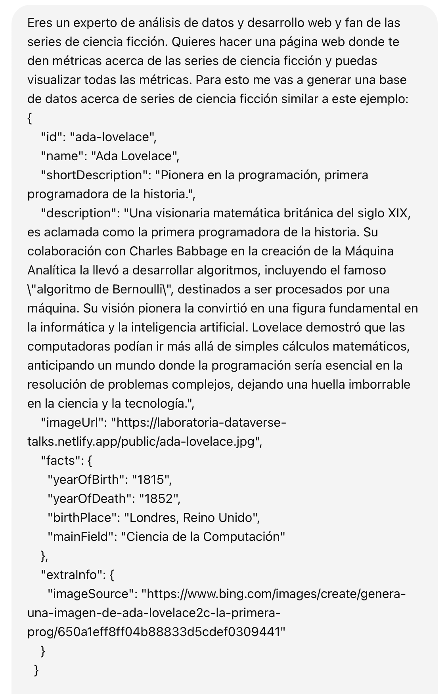
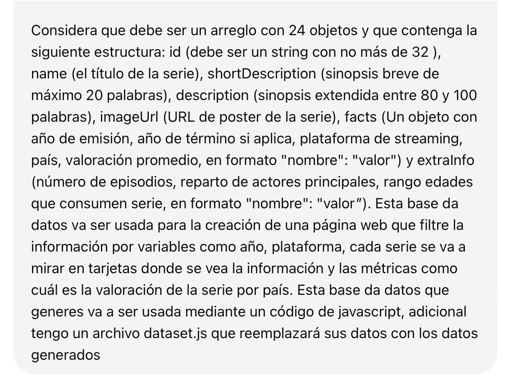
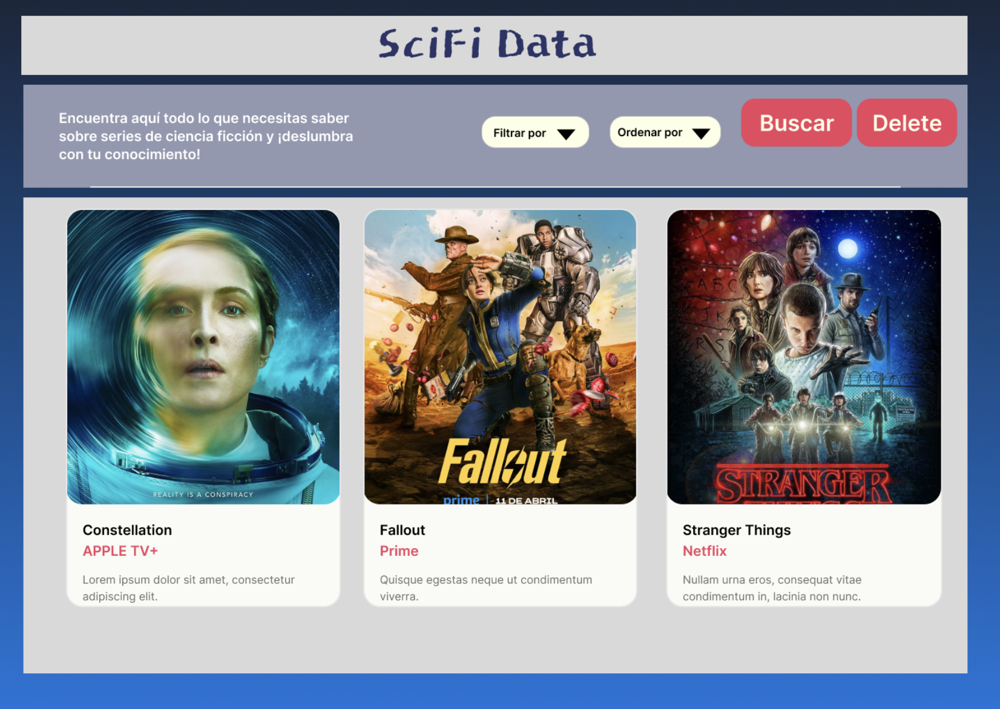

# Proyecto Dataverse

## Índice

* [1. Definición del producto](#1-definición-del-producto)
* [2. Historias de usuaria](#2-historias-de-usuaria)
* [3. Diseño de la Interfaz de Usuaria](#3-diseño-de-la-interfaz-de-usuaria)
* [4. Problemas detectados en tests de usabilidad](#4-problemas-detectados-en-tests-de-usabilidad)

***

## 1. Definición del producto

Sci-fi Data es una página web que ha sido construida para poder visualizar de forma rápida y sencilla un conjunto de datos relevantes sobre series televisivas de ciencia ficción. Se busca que cualquier persona pueda descubrir, aprender y disfrutar de información específica relacionada a una o varias series de sci-fi a través de nuestro producto.

_A través de chatGPT obtuvimos la data de las 24 series utilizadas en nuestro sitio. A continuación captura del prompting inicial:_

## 2. Historias de usuaria

1. Visualización de las 24 series televisivas de ciencia ficción con sus respectivas imágenes, títulos, descripciones breves, años de inicio y término y puntajes promedio.
    * **Como** _fan o simplemente usuario curioso_
    * **Quiero** _tener la mayor información posible_
    * **Para** _tener una panorámica general de las series de sci-fi_

2. Filtrado por plataforma de streaming.
    * **Como** _navegador curioso y ávido consumidor de series_
    * **Quiero** _saber cuáles series puedo encontrar en mi plataforma favorita_
    * **Para** _descubrir nuevas series_

3. Ordenado por título, año de lanzamiento o término y rating promedio.
    * **Como** _creador de contenido/bloguero/crítico_
    * **Quiero** _filtrar y ordenar rápidamente datos relevantes a considerar_
    * **Para** _optimizar mi tiempo en la búsqueda de datos_

4. Cálculo de años promedio de transmisión
    * **Como** _fan de la ciencia ficción_
    * **Quiero** _saber un cálculo estadístico de mi género televisivo favorito_
    * **Para** _sumar un nuevo dato a mi conocimiento de series sci-fi_

## 3. Diseño de la Interfaz de Usuaria

El prototipo para el UI se fue modificando sobre la marcha a medida de ir avanzando en los sprints. Se adoptó un estilo que evocara la temática. Para contenido de ciencia ficción se suele utilizar tonalidades frías por lo que empleamos matices de azules y sólo dimos un tono cálido a botones y para resaltar ciertos textos. La tipografía y efectos en contenido que se emplearon también buscan emular un universo futurista/espacial acorde.

Con este prototipo comenzamos:

Y el diseño finalmente resultó en esto:
 * _(aquí poner captura cuando tengamos revisado todo)_

## 4. Problemas detectados en tests de usabilidad

1. Primer estilo empleado poco atractivo, percibido como un blog.
2. El tamaño de la fuente en filtros era muy pequeña haciéndose difícil de leer.
3. Las imágenes dentro de las tarjetas se distorsionaban, generando ruido a usuaria.
4. Los botones no se adaptaban bien a pantallas más pequeñas.
